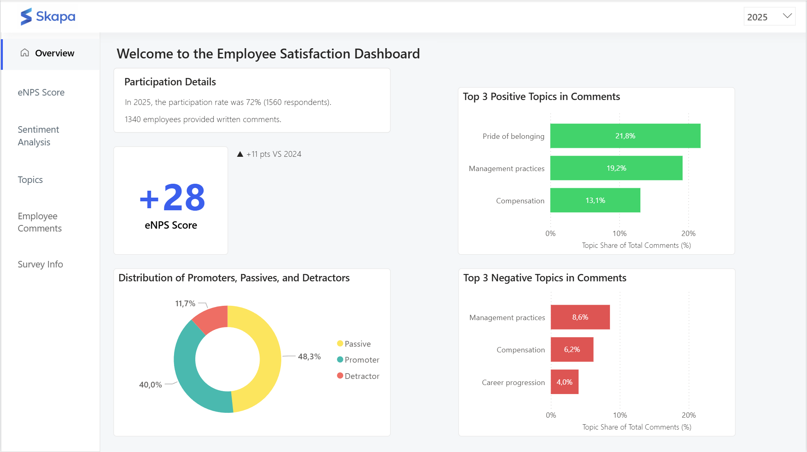

# Employee Satisfaction Survey Dashboard

## Dashboard Preview


## Project Overview
This project presents a **Power BI dashboard** designed to analyze the results of an **employee satisfaction survey**, combining structured survey data with **NLP-based insights** extracted from open-ended employee feedback.

The analysis focuses on the **eNPS (Employee Net Promoter Score)** and explores employee sentiment and key topics of satisfaction and dissatisfaction, while respecting data sensitivity constraints.


---

## Business Problem
**How can employee satisfaction survey results be analyzed and transformed into clear, actionable insights using a Power BI dashboard?**

The survey includes:
- A quantitative question:  
  *“How likely are you to recommend Skapa as a place to work?”* (eNPS score)
- An optional open-ended question:  
  *“What is the primary reason for your score?”*

The challenge is to:
- Analyze the eNPS score across multiple dimensions
- Extract sentiment and key themes from textual comments
- Present all insights in an interactive and readable Power BI dashboard

---

## Project Objectives
- Analyze the **eNPS score** by:
  - Country
  - Department
  - Employment status
  - Tenure range
- Detect the **sentiment of employee comments**:
  - 100% positive
  - 100% negative
  - Mixed
- Identify the **main themes** driving satisfaction and dissatisfaction

> Due to the sensitive nature of employee comments, **no generative AI models** are used.  
> Topic detection is performed using **BERTopic**, an unsupervised topic modeling approach.

---

## Company Context
**Skapa** is a **fictional European digital strategy consulting firm**, founded in Sweden in 2006.  
The company operates in **5 countries** and employs approximately **2,000 people**.

For the past **3 years**, Skapa has conducted an **annual employee satisfaction survey** to monitor engagement and workplace perception.

---

## Database Structure
The project relies on a relational database composed of **4 tables**:

1. **DIM_employee**  
   Static employee information

2. **DIM_employee_situation**  
   Snapshot of the employee’s situation at the time of the survey  
   (role, department, status — may change over time)

3. **DIM_date**  
   Calendar table used for time-based analysis

4. **FACT_survey_response**  
   Survey responses including:
   - recommendation rating (between 0 and 10)
   - optional open-ended comment

---

## Project Workflow

### 1. NLP Analysis (Python)
Two Jupyter notebooks are used:
- `part_1_sentiment_analysis_gh.ipynb`  
  → Sentiment detection using **VADER SentimentIntensityAnalyzer**
- `part_2_topic_analysis_gh.ipynb`  
  → Topic modeling using **BERTopic**

### 2. Data Transformation (SQL)
- **MySQL Workbench** is used to:
  - Create derived columns (e.g. seniority ranges)
  - Prepare analytical datasets for visualization

### 3. Data Visualization (Power BI)
- Data modeling
- DAX measures creation
- Interactive dashboard design

---

## Repository Structure

```text
employee_satisfaction_survey_dashboard/
│
├── data/
│   ├── raw/
│   ├── nlp_processed/
│   ├── mysql_workbench_ready/
│   └── power_bi_ready/
│
├── nlp/
│   ├── part_1_sentiment_analysis_gh.ipynb
│   └── part_2_topic_analysis_gh.ipynb
│
├── sql/
│   └── sql_queries.sql
│
├── info_database/
│   └── database_documentation.md
│
├── power_bi/
│   └── dashboard_screenshots/
│
└── README.md
```

## Data folders
- `raw/`: original survey data (no transformation)
- `nlp_processed/`: datasets enriched with sentiment and topic analysis
- `mysql_workbench_ready/`: datasets structured and enriched using SQL
- `power_bi_ready/`: final datasets imported into Power BI

---

## Tools & Technologies
- Python (Pandas, NLTK, VADER, BERTopic)
- Jupyter Notebook
- MySQL Workbench
- Power BI
- DAX
