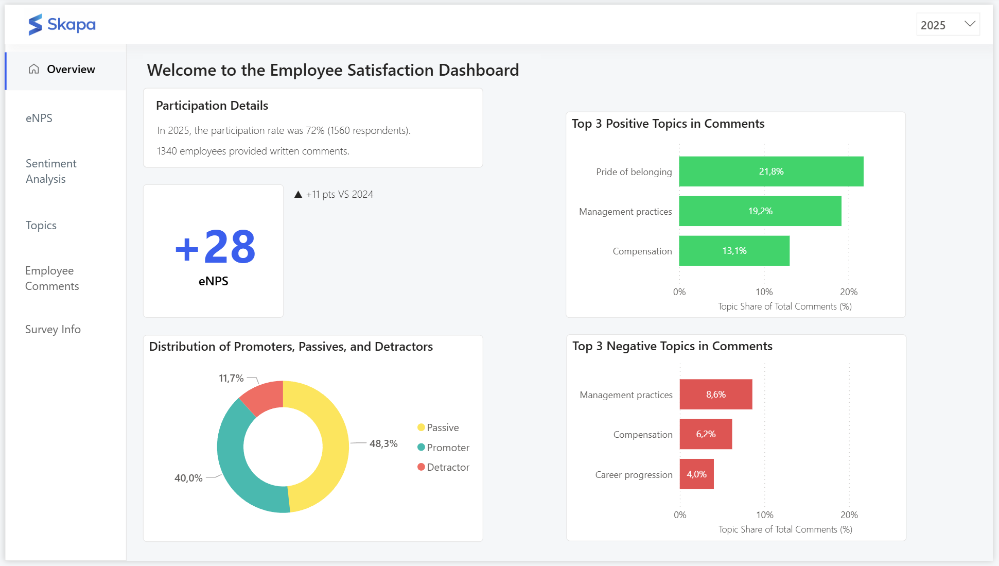
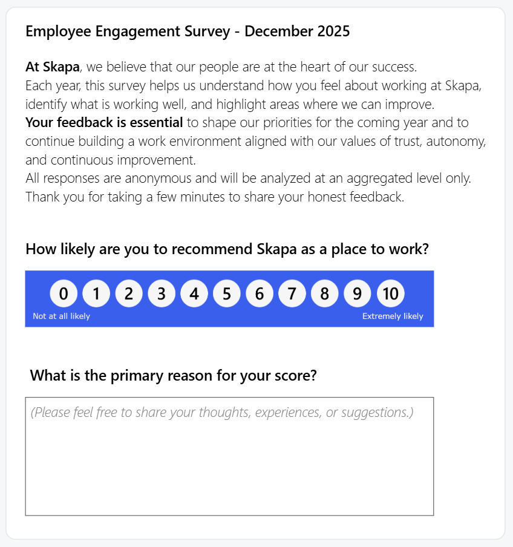
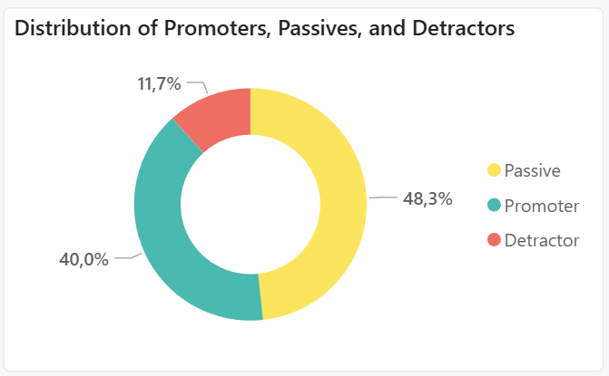
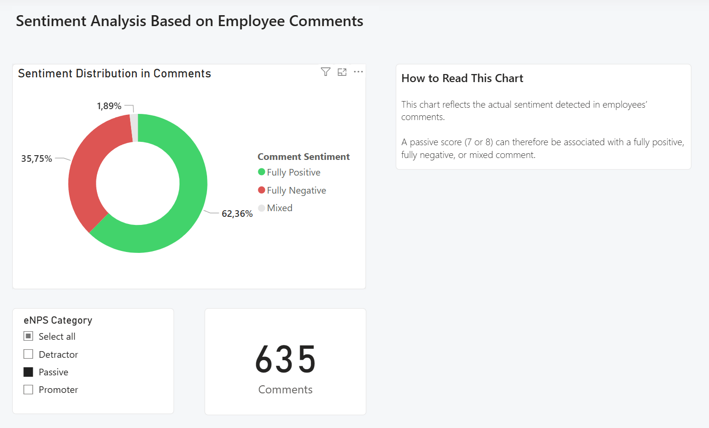
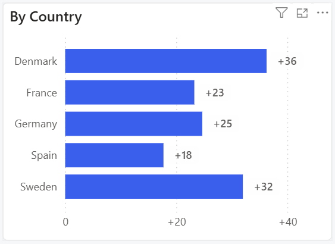
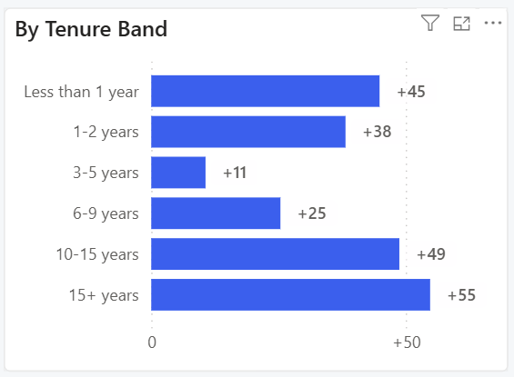
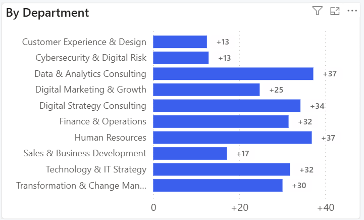
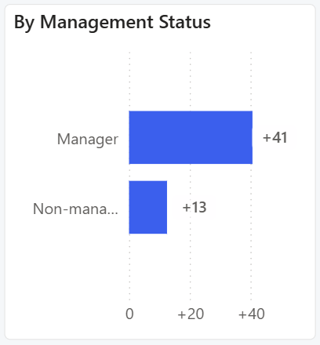
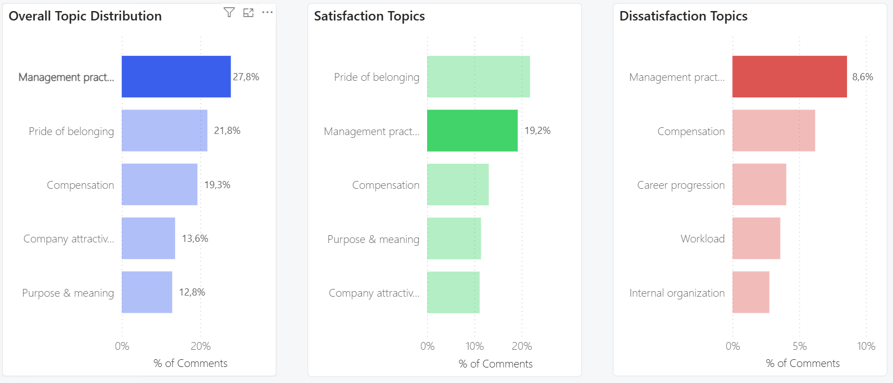

# Employee Satisfaction Survey Dashboard

## Dashboard Preview


## Project Overview
This project presents a **Power BI dashboard** designed to analyze the results of an **employee satisfaction survey**, combining structured survey data with **NLP-based insights** extracted from open-ended employee feedback.

The analysis focuses on the **eNPS (Employee Net Promoter Score)** and explores employee sentiment and key topics of satisfaction and dissatisfaction, while respecting data sensitivity constraints.


---

## Business Problem
**How can employee satisfaction survey results be analyzed and transformed into clear, actionable insights using a Power BI dashboard?**

The survey includes:
- A quantitative question (rating used to calculate the Employee Net Promoter Score):  
  *“How likely are you to recommend Skapa as a place to work?”*
- An optional open-ended question:  
  *“What is the primary reason for your score?”*

<br>
<p align="center">
  
</p>
<p align="center">
  <em>Employee Satisfaction Survey</em>
</p>

---

## Project Objectives
- Analyze the **eNPS** by:
  - Country
  - Department
  - Employment status
  - Tenure range
- Detect the **sentiment of employee comments**:
  - 100% positive
  - 100% negative
  - Mixed
- Identify the **main themes** driving satisfaction and dissatisfaction

> Due to the sensitive nature of employee comments, **no generative AI models** are used to analyse them.  
> Topic detection is performed using **BERTopic**, an unsupervised topic modeling approach.

---

## Company Context
**Skapa** is a **fictional European digital strategy consulting firm**, founded in Sweden in 2006.  
The company operates in **5 countries** and employs approximately **2,000 people**.

For the past **3 years**, Skapa has conducted an **annual employee satisfaction survey** to monitor engagement and workplace perception.

---

## Database Structure
The project relies on a relational database composed of **4 tables**:

1. **DIM_employee**  
   Static employee information

2. **DIM_employee_situation**  
   Snapshot of the employee’s situation at the time of the survey  
   (role, department, status - may change over time)

3. **DIM_date**  
   Calendar table used for time-based analysis

4. **FACT_survey_response**  
   Survey responses including:
   - recommendation rating (between 0 and 10)
   - optional open-ended comment

---

## Dataset Overview
The analysis is based on **4,391 survey responses** collected over **3 consecutive years**.

Out of these responses:
- **3,747 employees** provided an open-ended comment
- **644 responses** included a score only (no comment)

This dataset allows for both **quantitative eNPS analysis** and **qualitative NLP-based insights**.

---

## Project Workflow

### 1. NLP Analysis (Python)
Two Jupyter notebooks are used:
- `part_1_sentiment_analysis_gh.ipynb`  
  → Sentiment detection using **VADER SentimentIntensityAnalyzer**
- `part_2_topic_analysis_gh.ipynb`  
  → Topic modeling using **BERTopic**

### 2. Data Transformation (SQL)
- **MySQL Workbench** is used to:
  - Create derived columns (e.g. seniority ranges)
  - Prepare analytical datasets for visualization

### 3. Data Visualization (Power BI)
- Data modeling
- DAX measures creation
- Interactive dashboard design

---

## Repository Structure

```text
employee_satisfaction_survey_dashboard/
│
├── data/
│   ├── raw/
│   ├── nlp_processed/
│   ├── mysql_workbench_ready/
│   └── power_bi_ready/
│
├── nlp/
│   ├── part_1_sentiment_analysis_gh.ipynb
│   └── part_2_topic_analysis_gh.ipynb
│
├── sql/
│   └── sql_queries.sql
│
├── info_database/
│   └── database_documentation.md
│
├── power_bi/
│   └── dashboard_screenshots/
│
└── README.md
```

## Data folders
- `raw/`: original survey data with no transformations applied.
- `nlp_processed/`: fact_survey_response table enriched with sentiment analysis and topic modeling results.
- `mysql_workbench_ready/`: cleaned and structured dataset ready for import into MySQL Workbench.
- `power_bi_ready/`: final dataset optimized for Power BI and used for reporting and dashboard.

---

## Tools & Technologies
- Python (Pandas, NLTK, VADER, BERTopic)
- Jupyter Notebook
- MySQL Workbench
- Power BI
- DAX

---

## Key Insights

### 1. Distribution of Promoters, Passives, and Detractors

<p align="left">
  
</p>

A large proportion of survey respondents are classified as **Passives**, representing nearly **half of all respondents**.

<p align="left">
  
</p>

A deeper sentiment analysis of **Passive respondents** (ratings 7 and 8) reveals a strongly polarized distribution of opinions:

- **62.36%** of Passive respondents left **100% positive comments**
- **35.75%** left **100% negative comments**
- Only **1.89%** provided **mixed comments** combining both positive and negative elements

> Despite their neutral eNPS, Passive respondents often express **clear and decisive opinions**, reinforcing the value of sentiment analysis beyond numerical ratings alone.

---

### 2. Overall eNPS Trend
The overall **eNPS shows a clear upward trend since 2023**, reaching **+28 in 2025**:
- **+4 points in 2024**
- **+11 points in 2025**

This reflects a **significant improvement in employee perception** over the last two years.

---

### 3. eNPS by Country

<p align="left">
  
</p>

Strong disparities appear across countries:
- **Denmark** achieves the highest score (**eNPS +36**)
- **Sweden** also performs well (**eNPS +32**)
- **Spain** records the lowest score (**eNPS +18**)

However, Spain shows a **strong year-over-year improvement** (**+13 points vs. 2024**), while **France remains stable** (**0-point change vs. 2024**).

A deeper drill-down reveals major internal differences within Spain:  
the **Sales & Business Development** department records a **very low eNPS (-37)**.  
This constitutes a **critical insight for HR teams**, who could prioritize targeted actions to improve the employee experience in this department.

---

### 4. eNPS by Tenure Band

<p align="left">
  
</p>

Employee satisfaction follows a non-linear pattern over time:
- A noticeable **drop after the first year**
- The **lowest satisfaction level between 3 and 5 years of tenure** (**eNPS +11**)
- A steady recovery for more senior tenure bands
- The highest score is observed among employees with **15+ years of tenure** (**excellent eNPS of +55**)

> This pattern reveals a clear **U-shaped relationship between tenure and employee satisfaction**, with the lowest eNPS observed among employees with **3–5 years of tenure**.

> This indicates a phase of **employee disengagement emerging after the first year**, suggesting the need for HR teams to further investigate the underlying drivers of this decline and to define **targeted action plans** to re-engage employees during this critical career stage.

---

### 5. eNPS by Department

<p align="left">
  
</p>

Three departments stand out with **less favorable eNPS scores** compared to others:
- **Customer Experience & Design**: eNPS +13
- **Cybersecurity & Digital Risk**: eNPS +13
- **Sales & Business Development**: eNPS +17

These results indicate departments where **employee experience improvement actions could have the highest impact**.

---

### 6. eNPS by Employment Status (Manager vs. Non-Manager)

<p align="left">
  
</p>

A significant perception gap exists between hierarchical levels:
- **Managers**: eNPS **+41**
- **Non-managers**: eNPS **+13**

This gap suggests that company messaging and strategic vision may not be equally perceived across levels.  
HR actions could focus on **strengthening communication cascades** and ensuring that managerial narratives are effectively relayed to non-manager employees.

---

### 7. Key Themes from Employee Comments

<p align="left">
  
</p>

Topic modeling highlights several dominant themes:

- **Management practices** are the most discussed topic (**27.8% of comments**), appearing:
  - More often in a **positive context** (**19.2%**)
  - Than in a **negative one** (**8.6%**)

 > This makes management quality a **key driver of employee experience** at Skapa.  
 > Understanding and scaling best managerial practices, while addressing recurring criticisms, should be a priority.

- **Compensation** is also a major topic (**19.3% of comments**), with:
  - Approximately **two-thirds positive**
  - One-third negative

- Among positive themes:
  - **Pride in belonging to the company** is mentioned in **21.8% of comments**
  - **Purpose and meaning at work** appear in **11.4% of comments**

- Two less frequent but critical negative themes require attention:
  - **Workload** (**3.6%**)
  - **Governance & decision-making** (**2.3%**)

  Although mentioned less often, these topics represent **early warning signals** for HR teams aiming to further improve employee experience.

